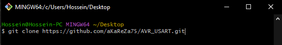
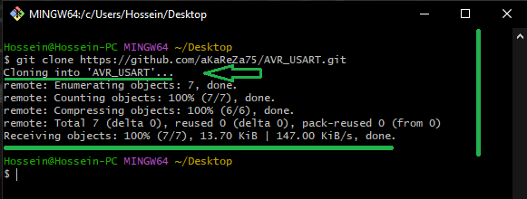
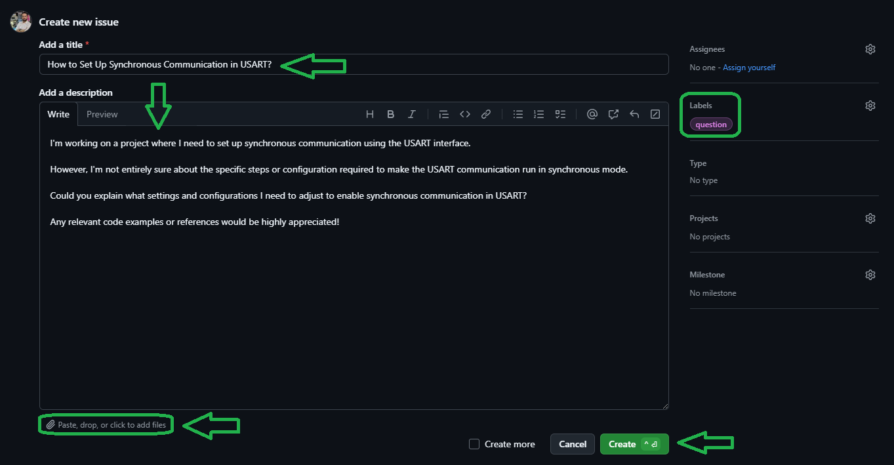

# USART (Universal Synchronous and Asynchronous serial Receiver and Transmitter)

The USART (Universal Synchronous and Asynchronous serial Receiver and Transmitter) is a crucial peripheral in the ATmega328 microcontroller, used for serial communication. It supports both asynchronous and synchronous communication modes. This allows the microcontroller to communicate with other devices (such as sensors, computers, or other microcontrollers) via UART or SPI, depending on the configuration.

## Registers

The USART module has several control and status registers that define its behavior. These registers are listed below, along with a bit-by-bit explanation for each.

### 1. **UCSR0A** - USART Control and Status Register A

| Bit  | Name     | Description                                                      |
|------|----------|------------------------------------------------------------------|
| 7    | RXC0     | USART Receive Complete: Set when the data is completely received. |
| 6    | TXC0     | USART Transmit Complete: Set when the data is completely transmitted. |
| 5    | UDRE0    | USART Data Register Empty: Set when the USART Data Register is empty and ready for new data. |
| 4    | FE0      | Frame Error: Set if a framing error is detected.                 |
| 3    | DOR0     | Data OverRun: Set if a data overrun error occurs.                |
| 2    | UPE0     | USART Parity Error: Set if a parity error is detected.           |
| 1    | U2X0     | Double the USART Transmission Speed: Controls the baud rate when set. |
| 0    | MPCM0    | Multi-processor Communication Mode: Enables multi-processor communication. |

### 2. **UCSR0B** - USART Control and Status Register B

| Bit  | Name     | Description                                                      |
|------|----------|------------------------------------------------------------------|
| 7    | RXCIE0   | USART Receive Interrupt Enable: Enables the USART receive interrupt. |
| 6    | TXCIE0   | USART Transmit Interrupt Enable: Enables the USART transmit interrupt. |
| 5    | UDRIE0   | USART Data Register Empty Interrupt Enable: Enables the interrupt when the data register is empty. |
| 4    | RXEN0    | Receiver Enable: Enables the USART receiver.                     |
| 3    | TXEN0    | Transmitter Enable: Enables the USART transmitter.               |
| 2    | UCSZ02   | Character Size: Defines the number of data bits for the communication. |
| 1    | RXB8     | Receive Data Bit 8: Used for 9-bit communication.                |
| 0    | TXB8     | Transmit Data Bit 8: Used for 9-bit communication.               |

### 3. **UCSR0C** - USART Control and Status Register C

| Bit  | Name     | Description                                                      |
|------|----------|------------------------------------------------------------------|
| 7    | UMSEL01  | USART Mode Select 1: Defines the USART mode (Asynchronous/Synchronous). |
| 6    | UMSEL00  | USART Mode Select 0: Defines the USART mode (Asynchronous/Synchronous). |
| 5    | UPM01    | Parity Mode 1: Defines parity bit mode (Even/Odd/None).          |
| 4    | UPM00    | Parity Mode 0: Defines parity bit mode (Even/Odd/None).          |
| 3    | USBS0    | Stop Bit Select: Defines the number of stop bits.                |
| 2    | UCSZ01   | Character Size 1: Defines the data frame size.                   |
| 1    | UCSZ00   | Character Size 0: Defines the data frame size.                   |
| 0    | UCPOL0   | Clock Polarity: Defines the clock polarity in synchronous mode. |

### 4. **UDR0** - USART Data Register

| Bit  | Name     | Description                                                      |
|------|----------|------------------------------------------------------------------|
| 7-0  | UDR0     | Data: Holds the data byte being transmitted or received.         |

## Baud Rate Calculation

The baud rate in USART communication determines the speed at which data is transmitted or received. It is calculated based on the system clock frequency and the desired baud rate. The formula for calculating the baud rate register value (UBRR) is:

```
UBRR = (F_CPU / (16 * BAUD)) - 1    /**< Normal Speed Mode (U2X = 0) */
UBRR = (F_CPU / (8 * BAUD)) - 1     /**< Double Speed Mode (U2X = 1) */
```

Where:
- `F_CPU` is the system clock frequency in Hz
- `BAUD` is the desired baud rate in bits per second
- `UBRR` is the value to be loaded into the USART baud rate registers (`UBRR0H` and `UBRR0L`)

### Baud Rate Calculation for Common Frequencies

Here are the UBRR values for common system clock frequencies and baud rates:

| CPU Frequency | Baud Rate | UBRR (Normal) | UBRR (U2X) |
|---------------|-----------|---------------|------------|
| 16 MHz        | 9600      | 103          | 207        |
| 16 MHz        | 115200    | 8            | 16         |
| 8 MHz         | 9600      | 51           | 103        |
| 8 MHz         | 115200    | 3            | 8          |

### Example Calculations

1. For a **16 MHz** clock and **9600 baud** (Normal Mode):
   ```
   UBRR = (16,000,000 / (16 * 9600)) - 1 = 103.166 → 103
   ```

2. For **16 MHz** and **115200 baud** (Normal Mode):
   ```
   UBRR = (16,000,000 / (16 * 115200)) - 1 = 8.681 → 8
   ```

3. For **8 MHz** and **9600 baud** (Normal Mode):
   ```
   UBRR = (8,000,000 / (16 * 9600)) - 1 = 51.083 → 51
   ```

4. For **8 MHz** and **115200 baud** (Normal Mode):
   ```
   UBRR = (8,000,000 / (16 * 115200)) - 1 = 3.340 → 3
   ```

### Baud Rate Error Analysis

The actual baud rate achieved may differ from the desired rate due to rounding of the UBRR value. The error can be calculated using:

```
Actual Baud = F_CPU / (16 * (UBRR + 1))           /**< Normal Mode */
Actual Baud = F_CPU / (8 * (UBRR + 1))            /**< U2X Mode */
Error (%) = ((Actual Baud - Desired Baud) / Desired Baud) * 100
```

### Comprehensive Error Analysis

| CPU Frequency | Desired Baud | Mode    | UBRR | Actual Baud | Error (%) |
|--------------|--------------|---------|------|-------------|-----------|
| 16 MHz       | 9600        | Normal  | 103  | 9615.38     | +0.16     |
| 16 MHz       | 9600        | U2X     | 207  | 9615.38     | +0.16     |
| 16 MHz       | 115200      | Normal  | 8    | 111111.11   | -3.55     |
| 16 MHz       | 115200      | U2X     | 16   | 117647.06   | +2.12     |
| 8 MHz        | 9600        | Normal  | 51   | 9615.38     | +0.16     |
| 8 MHz        | 9600        | U2X     | 103  | 9615.38     | +0.16     |
| 8 MHz        | 115200      | Normal  | 3    | 125000.00   | +8.51     |
| 8 MHz        | 115200      | U2X     | 8    | 111111.11   | -3.55     |

### U2X (Double Speed) Mode

The U2X bit in the UCSR0A register enables double speed mode, which can help reduce baud rate errors:

1. **Advantages of U2X Mode:**
   - Provides more accurate baud rates at higher speeds
   - Reduces timing errors in many cases
   - Essential for achieving certain baud rates with minimal error

2. **When to Use U2X Mode:**
   - At high baud rates (>38400)
   - When normal mode produces unacceptable error rates
   - When the calculated UBRR value is less than 10

3. **Implementation:**
   ```c
   bitSet  (UCSR0A, U2X0);   /**< Enable U2X mode */
   ```
   
### Best Practices
1. **Error Tolerance:**
   - For most applications, errors below ±2% are acceptable
   - For critical applications, keep errors below ±1%
   - Maximum recommended error is ±3.5%

2. **UBRR Selection:**
   - Choose the mode (Normal/U2X) that gives the smallest error
   - For high baud rates, prefer U2X mode
   - Avoid UBRR values less than 3 in normal mode

3. **Verification:**
   - Always calculate the actual baud rate and error
   - Test communication with intended devices
   - Monitor for framing errors during operation

## Zero-Error Crystal Frequencies

For applications requiring absolutely precise baud rates with zero error, specific crystal frequencies can be used. These frequencies are calculated to provide whole numbers when divided by the common baud rates, ensuring perfect timing.

### Recommended Crystal Frequencies for Zero Error

| Crystal Frequency | Supported Baud Rates           | UBRR Values (Normal Mode) | Notes |
|------------------|--------------------------------|---------------------------|-------|
| 11.0592 MHz      | 300, 600, 1200, 2400, 4800, 9600, 19200, 38400, 57600 | 2303, 1151, 575, 287, 143, 71, 35, 17, 11 | Most versatile for standard baud rates |
| 18.4320 MHz      | 1200, 2400, 4800, 9600, 19200, 38400, 57600, 115200 | 959, 479, 239, 119, 59, 29, 19, 9 | Good for high-speed applications |
| 7.3728 MHz       | 300, 600, 1200, 2400, 4800, 9600, 19200, 38400 | 1535, 767, 383, 191, 95, 47, 23, 11 | Power-efficient option |
| 14.7456 MHz      | 300, 600, 1200, 2400, 4800, 9600, 19200, 38400, 57600, 115200 | 3071, 1535, 767, 383, 191, 95, 47, 23, 15, 7 | Excellent for all common rates |

#### Example Calculations for 11.0592 MHz

For a crystal frequency of 11.0592 MHz at 9600 baud (Normal Mode):
```
UBRR = (11,059,200 / (16 * 9600)) - 1 = 71.0 (exact)
Actual Baud = 11,059,200 / (16 * (71 + 1)) = 9600.0 (zero error)
```

#### Benefits of Using Exact-Match Crystals

1. **Perfect Timing**:
   - Zero calculation error
   - No accumulated timing drift
   - Perfect frame synchronization

2. **Reliability Improvements**:
   - Reduced framing errors
   - Better noise immunity
   - More reliable long-term communication

3. **Multi-Rate Support**:
   - Single crystal supports multiple standard baud rates
   - Easy to switch rates without error concerns
   - Backward compatibility with legacy equipment

#### When to Use Exact-Match Crystals

1. **Critical Applications**:
   - Medical equipment
   - Industrial control systems
   - Financial transaction terminals
   - High-speed data logging systems

2. **Long-Distance Communication**:
   - RS-485 networks
   - Multi-drop serial buses
   - Long cable runs
   - Noisy industrial environments

3. **Legacy System Integration**:
   - Equipment with strict timing requirements
   - Systems sensitive to baud rate errors
   - Hardware with limited tolerance ranges

These specialized crystals are particularly important in systems where timing accuracy is critical or when working with multiple devices that must maintain perfect synchronization. While they may be slightly more expensive than standard crystals, the benefits in terms of reliability and accuracy often outweigh the additional cost.

## API Reference

This section provides a detailed description of the functions in the `usart.h` file for handling USART communication on the ATmega328 microcontroller. Each function is designed to manage data transmission and reception through USART, as well as configure the necessary registers.

> [!NOTE]  
> The macros used in the code below are all defined in the `aKaReZa.h` header file, and detailed descriptions of these macros can be found at the following link:  
> [https://github.com/aKaReZa75/AVR/blob/main/Macros.md](https://github.com/aKaReZa75/AVR/blob/main/Macros.md)

### Default Settings
| Setting           | Value                 |
|-------------------|-----------------------|
| Baud Rate         | 115200                |
| Data Bits         | 8 bits                |
| Parity            | None (No Parity)      |
| Stop Bits         | 1 stop bit            |
| Receive Method    | Interrupt-based (Default) |

### **Initialization**
```c
/*
 * Initializes the USART module.
 * This function must be called before any other USART function.
 * It configures the baud rate, frame format, and enables both the transmitter and receiver.
 */ 
void usart_Init(bool _initStatus);
```

> [!NOTE]
To modify the default settings (such as baud rate, data bits, stop bits, parity, etc.), 
the corresponding registers within the UCSR0A, UCSR0B, and UCSR0C registers can be adjusted 
according to the desired configuration. This will allow you to customize the USART settings
for specific use cases.

**Example:**
```c
#include "aKaReZa.h"
#include "usart.h"

int main(void) 
{
    usart_Init(Initialize); /**< Initialize USART with default settings */
    while(1)
    {
        /* ... your code ... */
    }
}
```

### **Transmit Data**
```c
/*
 * Writes a byte of data to the USART data register.
 * This function waits for the USART data register to be empty before transmitting.
 * 
 * @param _Data: The byte of data to transmit.
 */ 
void usart_Write(uint8_t _Data);
```

**Example:**
```c
#include "aKaReZa.h"
#include "usart.h"

int main(void) 
{
    usart_Init(Initialize); /**< Initialize USART */
    usart_Write('A'); /**< Transmit the character 'A' */
    
    while(1)
    {
        /* ... your code ... */
    }
}
```

### **Send String**
```c
/*
 * Sends a null-terminated string over USART.
 * The string is transmitted byte by byte until the null terminator is reached.
 * 
 * @param _Data: The null-terminated string to be transmitted.
 */
void usart_Puts(char* _Data);
```

**Example:**
```c
#include "aKaReZa.h"
#include "usart.h"

int main(void) 
{
    usart_Init(Initialize); /**< Initialize USART */
    usart_Puts("Hello, USART!"); /**< Send a string */
    
    while(1)
    {
        /* ... your code ... */
    }
}
```

### **Send String with Null-terminated**
```c
/*
 * Sends a null-terminated string over USART followed by a carriage return (CR) and newline (NL) character.
 * This is useful for protocols that require both carriage return and line break after each message.
 * 
 * @param _Data: The null-terminated string to be transmitted, followed by a carriage return and newline.
 */
void usart_Putsln(char* _Data);
```

**Example:**
```c
#include "aKaReZa.h"
#include "usart.h"

int main(void) 
{
    usart_Init(Initialize); /**< Initialize USART */
    usart_Putsln("Hello, world!"); /**< Send string with carriage return and newline */
    while(1)
    {
        /* Your main loop code here */
    }
}
```

### **Receive Data**
```c
/*
 * Waits for incoming data and returns one byte of data.
 * This function blocks until the data is received.
 * 
 * @return The received byte of data.
 */
uint8_t usart_getChar(void);
```

**Example:**
```c
#include "aKaReZa.h"
#include "usart.h"
#include "alcd.h"

uint8_t receivedData = 0x00;

int main(void) 
{
    alcd_init(); /**< Initialize the LCD */    
    usart_Init(Initialize); /**< Initialize USART */

    while(1)
    {
        uint8_t receivedData = usart_getChar(); /**< Receive one byte of data */
        alcd_putc(receivedData); /**< Print Receive data from usart to the LCD */    
    }
}
```

### **Flush Buffers**
```c
/*
 * Clears the USART receive and transmit buffers.
 * This function ensures that any leftover or unprocessed data is cleared.
 * It can be used to maintain data integrity by flushing the buffers before starting new transmission.
 */ 
void usart_Flush(void);
```

**Example:**
```c
#include "aKaReZa.h"
#include "usart.h"

int main(void) 
{
    usart_Init(Initialize); /**< Initialize USART */
    usart_Flush(); /**< Flush USART buffers */
    
    while(1)
    {
        /* ... your code ... */
    }
}
```

## USART Receive Interrupt and Ring Buffer

By default, USART communication in this library is configured to receive data using interrupts. When data is received, the USART Receive Interrupt Service Routine (ISR) is triggered, and the received data is stored in a **ring buffer**. This buffer is pre-configured with a default size of **32 bytes** for data, plus **1 byte** for the null terminator, making the total buffer size **33 bytes**. This size is defined in the `usart.h` file.

### Buffer Configuration

The buffer for storing received data is declared as:

```c
char usart_RxBuffer[__usart_RxBufferSize];
```
Where the default buffer size is set by `__usart_RxBufferSize` (32 bytes + 1 by default).

> [!CAUTION]
The buffer size should be chosen carefully to ensure that enough space is available to store the received data without losing any. However, it is equally important to avoid allocating excessive memory, as SRAM is limited on microcontrollers. A well-balanced buffer size ensures that you can handle incoming data efficiently while optimizing memory usage.

### Flag and Buffer Usage

To use the receive buffer in your code, you need to declare the following variables as `extern` in the file where you want to access the received data:

```c
extern bool usart_RxFlag;  
extern char usart_RxBuffer[__usart_RxBufferSize];  
```

The `usart_RxFlag` flag is set to `true` when a complete line of data has been received. This happens when the USART ISR detects the end of the received data, which is marked by either a **newline (`\n`)** or **carriage return (`\r`)**, or both.

### How to Read Data

The USART receive interrupt works by checking if any errors occur (such as buffer overflow, framing errors, or data overrun). If there are no errors, the received byte is stored in the `usart_RxBuffer` until a newline (`\n`) or carriage return (`\r`) is encountered, at which point the data is considered complete.

If the buffer is full, the `usart_RxBUfferOVF` flag will be set to `true` to indicate that the buffer overflowed and some data might have been lost.

Once the `usart_RxFlag` is set to `true`, the data can be read from the `usart_RxBuffer`:

```c
if(usart_RxFlag) 
{
    /* Process the received data
       Example: Print the received data to the LCD */
    alcd_puts(usart_RxBuffer);
    
    usart_Flush();  /* Clears the flag and the buffer, preparing for new data */
}
```

> [!CAUTION]
Always ensure that global interrupts are enabled using the `sei()` function. Without enabling global interrupts, the microcontroller will not respond to any interrupt triggers.  
The `sei()` function sets the Global Interrupt Flag (I-bit) in the Status Register (SREG), which allows interrupt requests to be processed by the microcontroller.

You can use the following macros to enable and disable global interrupts:

- **`globalInt_Enable`**: This macro is equivalent to calling `sei()`. It enables global interrupts, allowing the microcontroller to respond to interrupt requests.

- **`globalInt_Disable`**: This macro is equivalent to calling `cli()`. It disables global interrupts, preventing the microcontroller from processing any interrupts.


The data is stored in `usart_RxBuffer` and can be processed as needed. Each new line of data will overwrite the previous content in the buffer. The buffer will continue to receive new data as long as the USART interrupt routine is running. After processing the data, calling `usart_Flush()` will clear the buffer and reset the flag, preparing the system to receive the next set of data without any issues.

### Summary
| Function         | Description                                                    |
|------------------|----------------------------------------------------------------|
| `usart_Init`     | Initializes the USART peripheral|
| `usart_Write`    | Transmits a single byte of data via USART. |
| `usart_Puts`     | Sends a null-terminated string over USART.  |
| `usart_Putsln`   | Sends a null-terminated string followed by carriage return and newline characters |
| `usart_getChar`  | Receives a byte of data from USART. Blocks until data is received. |
| `usart_Flush`    | Clears the receive buffer, resets buffer index, and clears error flags. |

## Complete Example
```c
#include "aKaReZa.h"
#include "usart.h"

extern bool usart_RxFlag;  
extern char usart_RxBuffer[__usart_RxBufferSize];  

int main(void) 
{
    usart_Init(true); /**< Initialize USART */
    
    usart_Putsln("Hello, world with carriage return and newline!"); /**< Send string with CR and NL */
    
    while(1)
    {
        if(usart_RxFlag) 
        {
            /* Process the received data
               Example: Print the received data to the LCD */
            alcd_puts(usart_RxBuffer);
            
            usart_Flush();  /* Clears the flag and the buffer, preparing for new data */
        }
    }
}
```

## Important Notes
- Always ensure that the baud rate is correctly configured.
- For string transmission, ensure the string is properly null-terminated (`'\0'`) to prevent incorrect transmission behavior.
- **usart_frameError**: Checks if a framing error has occurred in the USART communication.
- **usart_daraOverRun**: Checks if a data overrun error has occurred.
These macros help you detect communication errors related to framing and data overrun.
- **Receive with Interrupts**: Data is received via interrupts, which ensures that the USART can asynchronously collect data.
- **Ring Buffer**: The received data is stored in a ring buffer (`usart_RxBuffer`) with a default size of 32 bytes. You can modify the buffer size in `usart.h` if needed.
- **Flag Usage**: The `usart_RxFlag` is used to indicate when a complete line of data is received. You should check this flag before reading data from the buffer.
- **Termination Characters**: The received data is considered complete when a newline (`\n`) or carriage return (`\r`) character is encountered. You can adjust this based on your communication protocol's requirements.

# 🔗 Resources
  Here you'll find a collection of useful links and videos related to the topic of AVR microcontrollers.  
  
> [!TIP]
> The resources are detailed in the sections below.  
> To access any of them, simply click on the corresponding blue link.

- [aKaReZa 66 - AVR, Communication, USART - Part A](https://youtu.be/TJEfbymLoTs)  
    ---  
    Learn about USART features and specifications in the ATMega328 microcontroller, including baud rate calculation, registers, single character and string transmission, escape sequences, data frames, and differences in simulation and practical testing.

- [aKaReZa 67 - AVR, Communication, USART - Part B](https://youtu.be/HWJqS9NjYIA)  
    ---  
    Continuation of USART communication, discussing escape sequences, byte reception, baud rate errors and solutions, double speed mode, data reception with interrupts, circular buffer, USART flags, debugging, and data frames.

- [AVR Microntroller](https://github.com/aKaReZa75/AVR)
  ---  
    This repository contains comprehensive resources for AVR microcontrollers, including hardware schematics, software libraries, and educational projects.


# 💻 How to Use Git and GitHub
To access the repository files and save them on your computer, there are two methods available:
1. **Using Git Bash and Cloning the Repository**
   - This method is more suitable for advanced users and those familiar with command-line tools.
   - By using this method, you can easily receive updates for the repository.

2. **Downloading the Repository as a ZIP file**
   - This method is simpler and suitable for users who are not comfortable with command-line tools.
   - Note that with this method, you will not automatically receive updates for the repository and will need to manually download any new updates.

## Clone using the URL.
First, open **Git Bash** :
-  Open the folder in **File Explorer** where you want the library to be stored.
-  **Right-click** inside the folder and select the option **"Open Git Bash here"** to open **Git Bash** in that directory.


> [!NOTE] 
> If you do not see the "Open Git Bash here" option, it means that Git is not installed on your system.  
> You can download and install Git from [this link](https://git-scm.com/downloads).  
> For a tutorial on how to install and use Git, check out [this video](https://youtu.be/BsykgHpmUt8).
  
-  Once **Git Bash** is open, run the following command to clone the repository:

 ```bash
git clone https://github.com/aKaReZa75/AVR_USART.git
```
- You can copy the above command by either:
- Clicking on the **Copy** button on the right of the command.
- Or select the command text manually and press **Ctrl + C** to copy.
- To paste the command into your **Git Bash** terminal, use **Shift + Insert**.



- Then, press Enter to start the cloning operation and wait for the success message to appear.



> [!IMPORTANT]
> Please keep in mind that the numbers displayed in the image might vary when you perform the same actions.  
> This is because repositories are continuously being updated and expanded. Nevertheless, the overall process remains unchanged.

> [!NOTE]
> Advantage of Cloning the Repository:  
> - **Receiving Updates:** By cloning the repository, you can easily and automatically receive new updates.  
> - **Version Control:** Using Git allows you to track changes and revert to previous versions.  
> - **Team Collaboration:** If you are working on a project with a team, you can easily sync changes from team members and collaborate more efficiently.  

## Download Zip
If you prefer not to use Git Bash or the command line, you can download the repository directly from GitHub as a ZIP file.  
Follow these steps:  
1. Navigate to the GitHub repository page and Locate the Code button:
   - On the main page of the repository, you will see a green Code button near the top right corner.

2. Download the repository:
   - Click the Code button to open a dropdown menu.
   - Select Download ZIP from the menu.

    

3. Save the ZIP file:
   - Choose a location on your computer to save the ZIP file and click Save.

4. Extract the ZIP file:
   - Navigate to the folder where you saved the ZIP file.
   - Right-click on the ZIP file and select Extract All... (Windows) or use your preferred extraction tool.
   - Choose a destination folder and extract the contents.

5. Access the repository:
   - Once extracted, you can access the repository files in the destination folder.

> [!IMPORTANT]
> - No Updates: Keep in mind that downloading the repository as a ZIP file does not allow you to receive updates.    
>   If the repository is updated, you will need to download it again manually.  
> - Ease of Use: This method is simpler and suitable for users who are not comfortable with Git or command-line tools.

# 📝 How to Ask Questions
If you have any questions or issues, you can raise them through the **"Issues"** section of this repository. Here's how you can do it:  

1. Navigate to the **"Issues"** tab at the top of the repository page.  

  

2. Click on the **"New Issue"** button.  
   
  

3. In the **Title** field, write a short summary of your issue or question.  

4. In the "Description" field, detail your question or issue as thoroughly as possible. You can use text formatting, attach files, and assign the issue to someone if needed. You can also use text formatting (like bullet points or code snippets) for better readability.  

5. Optionally, you can add **labels**, **type**, **projects**, or **milestones** to your issue for better categorization.  

6. Click on the **"Submit new issue"** button to post your question or issue.
   
  

I will review and respond to your issue as soon as possible. Your participation helps improve the repository for everyone!  

> [!TIP]
> - Before creating a new issue, please check the **"Closed"** section to see if your question has already been answered.  
>     
> - Write your question clearly and respectfully to ensure a faster and better response.  
> - While the examples provided above are in English, feel free to ask your questions in **Persian (فارسی)** as well.  
> - There is no difference in how they will be handled!  

> [!NOTE]
> Pages and interfaces may change over time, but the steps to create an issue generally remain the same.

# 🤝 Contributing to the Repository
To contribute to this repository, please follow these steps:
1. **Fork the Repository**  
2. **Clone the Forked Repository**  
3. **Create a New Branch**  
4. **Make Your Changes**  
5. **Commit Your Changes**  
6. **Push Your Changes to Your Forked Repository**  
7. **Submit a Pull Request (PR)**  

> [!NOTE]
> Please ensure your pull request includes a clear description of the changes you’ve made.
> Once submitted, I will review your contribution and provide feedback if necessary.

# 🌟 Support Me
If you found this repository useful:
- Subscribe to my [YouTube Channel](https://www.youtube.com/@aKaReZa75).
- Share this repository with others.
- Give this repository and my other repositories a star.
- Follow my [GitHub account](https://github.com/aKaReZa75).

# 📜 License
This project is licensed under the GPL-3.0 License. This license grants you the freedom to use, modify, and distribute the project as long as you:
- Credit the original authors: Give proper attribution to the original creators.
- Disclose source code: If you distribute a modified version, you must make the source code available under the same GPL license.
- Maintain the same license: When you distribute derivative works, they must be licensed under the GPL-3.0 too.
- Feel free to use it in your projects, but make sure to comply with the terms of this license.
  
# ✉️ Contact Me
Feel free to reach out to me through any of the following platforms:
- 📧 [Email: aKaReZa75@gmail.com](mailto:aKaReZa75@gmail.com)
- 🎥 [YouTube: @aKaReZa75](https://www.youtube.com/@aKaReZa75)
- 💼 [LinkedIn: @akareza75](https://www.linkedin.com/in/akareza75)
